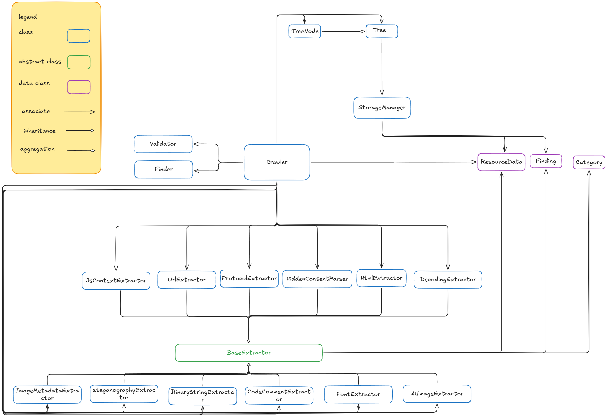

## Key Capabilities
- **Advanced DOM Parsing:** Extracts hidden attributes, rendered text, embedded JSON, and canvas data.
- **Network Interception:** Captures background XHR responses, WebSockets, cookies, and headers.
- **Deep Obfuscation Checks:** Automatically uncovers and decodes Base64, Base32, Hex, ROT13, URL encoding, reversed strings, and zero-width steganography.
- **Media Analysis:** Mines image EXIF metadata, hidden PNG/JPEG chunks, LSB steganography, and embedded fonts.
- **GenAI Computer Vision:** Uses the Antigravity CLI (`agy`) for AI-powered OCR to visually analyze images.

## Table of Contents
- [Key Capabilities](#key-capabilities)
- [Setup](#setup)
- [Environment Variables](#environment-variables)
- [Usage](#usage)
  - [Options](#options)
- [Output](#output)
- [Architecture](#architecture)

## Setup

1. **Install Python dependencies:**
   ```bash
   pip install -r requirements.txt
   ```
2. **Install Playwright browsers:**
   ```bash
   playwright install chromium
   ```
3. **Install Antigravity CLI (Required for AI features):**
   The `--ai` flag requires the Antigravity CLI (`agy`). Download and install it from the official site:
   - Documentation & Installer: [https://antigravity.google/docs](https://antigravity.google/docs)
   - After installing, run `agy` in your terminal once to authenticate.

## Environment Variables

The crawler requires the following environment variables to point to the target site and authenticate:

**Windows (PowerShell):**
```powershell
$env:CRAWL_BASE_URL="http://YOUR_URL_HERE/"
$env:CRAWL_USERNAME="your_username"
$env:CRAWL_PASSWORD="your_password"
```

**Windows (Command Prompt):**
```cmd
set CRAWL_BASE_URL=http://YOUR_URL_HERE/
set CRAWL_USERNAME=your_username
set CRAWL_PASSWORD=your_password
```

**Linux / macOS:**
```bash
export CRAWL_BASE_URL="http://YOUR_URL_HERE/"
export CRAWL_USERNAME="your_username"
export CRAWL_PASSWORD="your_password"
```

## Usage

Run the crawler by executing `crawler.py`:

```bash
python crawler.py [OPTIONS]
```

### Options

- `--interaction` : Enables synthetic user interactions (like auto-scrolling and hovering/clicking) on pages to trigger JS-rendered content.
- `--ai` : Enables GenAI-powered OCR via `agy_cli` to scan canvas blobs and image files for visual passwords (requires `agy` CLI to be available on your system).

## Output

- Extracted files and metadata are saved locally into the `./data` directory in a hierarchical folder tree based on the URLs.
- Validated passwords discovered during the crawl are logged incrementally to `PASSWORD_FOUND.txt`.

## Architecture
this is the UML class diagram of this project. 

